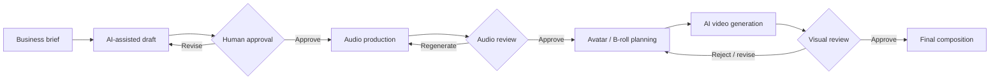

# n8n AI Video Automation — Portfolio Showcase

> **Portfolio showcase only.** This repository documents the architecture and business logic of a real internal automation project. It intentionally does **not** contain the production n8n workflows, prompts, credentials, endpoints, provider identifiers, routing rules, or other proprietary implementation details.

## What this project demonstrates

A human-controlled AI content and video production system orchestrated with **n8n**.

The project was designed to reduce manual coordination across multiple AI services while preserving human approval at the points where quality, cost, and brand risk matter most.

### Capabilities demonstrated

- Multi-stage n8n workflow orchestration
- AI-assisted script generation and revision
- Structured state management across production stages
- REST API and webhook integrations
- Human-in-the-loop approval gates
- Audio generation and review workflow
- Avatar / AI-video production routing
- Multi-scene visual planning
- Reference-asset handling
- Validation and stop conditions
- Error prevention and cost-control logic
- Provider-independent workflow design

## High-level architecture

The production system is intentionally more detailed than this diagram. The public version shows the **architecture pattern**, not the implementation recipe.

## My role

**AI Automation Consultant & Workflow Designer**

I translated the business process into an automation architecture, defined approval and validation stages, coordinated API-based services, structured workflow state, and iterated the system through real execution testing.

The focus was not simply “connect tools together.” The main design problem was controlling **what may proceed automatically, what requires human approval, and what must stop when required data or media is missing or invalid**.

## Technologies

The production project uses n8n plus external AI and media APIs. Selected providers used during development include OpenAI, ElevenLabs, HeyGen and AI-video generation services.

Exact production configuration, prompts, credentials, model identifiers and routing rules are not published.

## Design principles

1. **Human approval before expensive generation**
2. **No silent fallback when required assets are invalid**
3. **Persistent job state between production stages**
4. **Clear separation between editorial, audio, avatar and visual stages**
5. **Provider calls isolated behind workflow contracts**
6. **Cost-aware generation and regeneration**
7. **Failure should stop the pipeline rather than produce an incorrect deliverable**

## What is intentionally not public

- Production workflow JSON
- API keys, credential names or tokens
- Webhook URLs and infrastructure addresses
- Internal file paths
- Provider account or asset IDs
- Voice / avatar identifiers
- Prompt libraries
- Detailed state schemas
- Cost formulas and provider-routing logic
- Full validation and retry logic
- Production data or client information

## Commercial use

This repository is a portfolio case study, not an open-source template. The underlying production system and implementation methodology remain proprietary.

For consulting or implementation work involving n8n, AI workflow troubleshooting, API integration or business-process automation, contact me through my professional profile.
